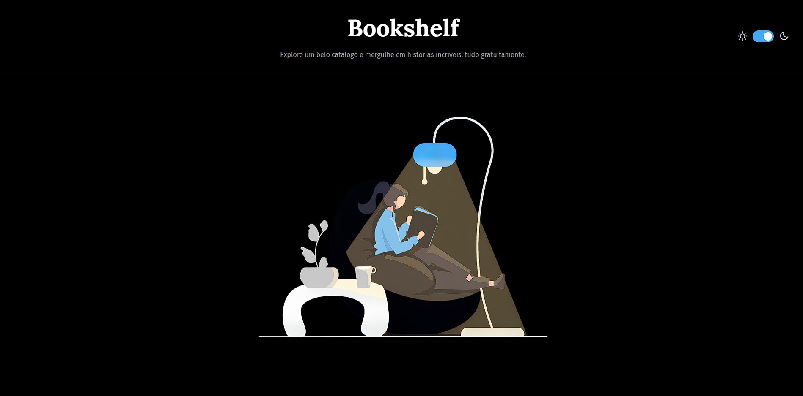

# Bookshelf

O **Bookshelf** é uma plataforma digital moderna e minimalista, criada para disponibilizar livros gratuitamente do gosto do criador para quem se interessa por literatura. A bookshelf é um projeto sem fins lucrativos, criada unicamente por diversão com design é original, simples e criativo.



## Funcionalidades Principais

* **Design Responsivo:** A interface se adapta a diferentes tamanhos de tela, garantindo uma ótima experiência em dispositivos móveis.
* **Tema Claro e Escuro:** Alterne facilmente entre os modos de visualização para maior conforto, especialmente em ambientes de pouca luz.
* **Animações e Transições:** Efeitos visuais suaves nos botões e nos cards de livros tornam a navegação mais dinâmica e agradável.
* **Catálogo de Livros Interativo:** Uma grade organizada de cards de livros que, ao passar o mouse, revela uma opção para leitura, reforçando a proposta de ser uma biblioteca digital acessível.

## Tecnologias Utilizadas

* **HTML:** Estrutura e marcação do conteúdo.
* **CSS:** Estilização e design da interface.
* **JavaScript:** Lógica e interatividade, incluindo a funcionalidade de alternar temas.

## Como Usar o Repositório

Se você deseja explorar ou modificar o código localmente, siga estes passos simples:

1.  Clone o repositório para sua máquina:
    ```bash
    git clone [https://github.com/ericdalaporta/bookshelf.git](https://github.com/ericdalaporta/bookshelf.git)
    ```
2.  Navegue até a pasta do projeto:
    ```bash
    cd bookshelf
    ```
3.  Abra o arquivo `index.html` em seu navegador web para visualizar o site.

## Contribuição

Contribuições são bem-vindas! Se você tiver sugestões, ideias para melhorias ou encontrar algum bug, sinta-se à vontade para abrir uma _issue_ ou enviar um _pull request_.

**Autor e contato**

Eric Dala Porta, ericdasilvadalaporta@gmail.com
